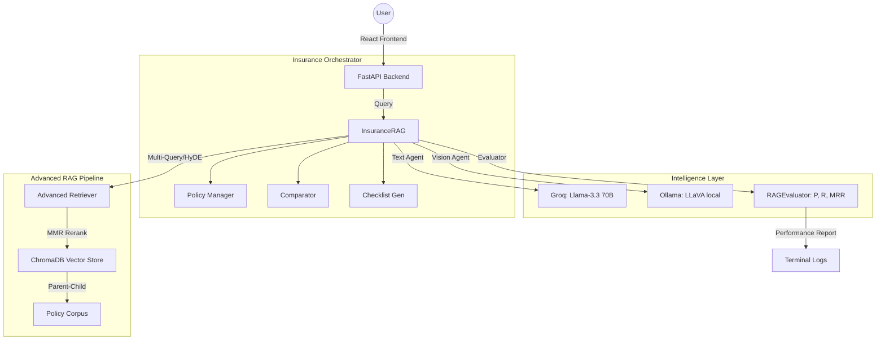

# 🛡️ InsureAI — Professional Multimodal Insurance Assistant

A state-of-the-art **Production RAG System** designed for the insurance industry. InsureAI transforms complex policy documents into a professional, enterprise-grade AI assistant that helps users understand coverage, compare plans, and generate claim checklists.

---

## ✨ Key Features

### 🏢 Professional Dashboard UI
- **Modern Dashboard**: Built with **React** and **Vite**, featuring a clean, minimal light theme (#1E3A8A).
- **Responsive Navigation**: Sidebar-based app layout with distinct sections for Chat, Comparison, and Uploads.
- **Glassmorphism Design**: Premium aesthetics inspired by Stripe and Linear.

### 📜 Insurance Intelligence
- **Multi-Policy Manager**: Register and track multiple policy PDFs simultaneously.
- **Policy Comparator**: Intelligent side-by-side comparison tables (Markdown/GFM) for benefits and premiums.
- **Claim Checklist Generator**: Personalised step-by-step guides for filing claims based on specific accidental or medical scenarios.
- **Exclusion Finder**: Instantly surfaces all "not covered" clauses across multiple documents.
- **Document Analyser**: Vision-powered analysis (CLIP/LLaVA) for medical bills and rejection letters.

### 🇮🇳 Multilingual Support
- **12 Indian Languages**: Communicate in Hindi, Tamil, Telugu, Marathi, and more.
- **Auto-Translation**: Real-time translation of complex insurance jargon into local languages.

### 🧪 Advanced RAG Evaluation
- **Live Performance Monitoring**: Real-time calculation of **Precision**, **Recall**, and **MRR**.
- **LLM-as-Judge**: Automated scoring for **Faithfulness** (hallucination detection) and **Relevance**.
- **MMR Reranking**: Maximal Marginal Relevance ensures retrieved context is diverse and comprehensive.

---

## 🏗️ Architecture



---

## 📁 Project Structure

```
insure_ai/
├── api/                    # FastAPI endpoints & Multi-part upload
├── insurance/              # Domain logic (Comparator, Checklist, Exclusions)
├── evaluation/             # Metrics: Precision, Recall, MRR, Faithfulness
├── retrieval/              # Advanced Retreat: HyDE, Multi-Query, MMR
├── vectorstore/            # ChromaDB persistence & BM25 fallback
├── llm/                    # Client routers for Groq, Ollama, and Gemini
├── security/               # Security layer: Jailbreak & Sanitization
├── frontend/               # React + Tailwind + Framer Motion (Modern Dashboard)
├── config.py               # Centralised master configuration
└── rag_system.py           # Core production RAG backbone
```

---

## 🚀 Installation & Setup

### 1. Backend Setup
```bash
# Install dependencies
pip install -r requirements.txt

# Configure environment
cp .env.template .env
# Add your GROQ_API_KEY from https://console.groq.com

# Start API
python run_api.py
```

### 2. Frontend Setup
```bash
cd frontend
npm install
npm run dev
```

### 3. Requirements
- **Ollama**: Required for local Vision (Bill Analysis) and fallback text.
  ```bash
  ollama pull llama3:latest
  ollama pull llava:latest
  ```

---

## 📊 Evaluation & Metrics

The system logs a detailed **RAG Performance Report** for every query to the terminal:

| Metric | Accuracy Focus | Description |
|--------|----------------|-------------|
| **Precision** | Retrieval | How many retrieved chunks were relevant? |
| **Recall** | Coverage | Did we find all the necessary info in the policy? |
| **MRR** | Rank Quality | Is the most relevant answer appearing at the top? |
| **Faithfulness** | Hallucination | Does the answer strictly follow the retrieved facts? |

---

## 🛡️ Security & Privacy
- **Local-First Processing**: Policy documents are processed and stored on your local machine.
- **Security Layer**: Built-in protection against prompt injection and role-play attacks.
- **Enterprise Logging**: Full audit trail of all JSON-structured security events.

---

## 💰 Cost Analysis
- **Groq/Ollama/ChromaDB**: All core components are free or open-source.
- **Total Operational Cost**: **₹0** (Zero).

---
*Created by Vishesh (GitHub: [Vishesh193](https://github.com/Vishesh193))*
