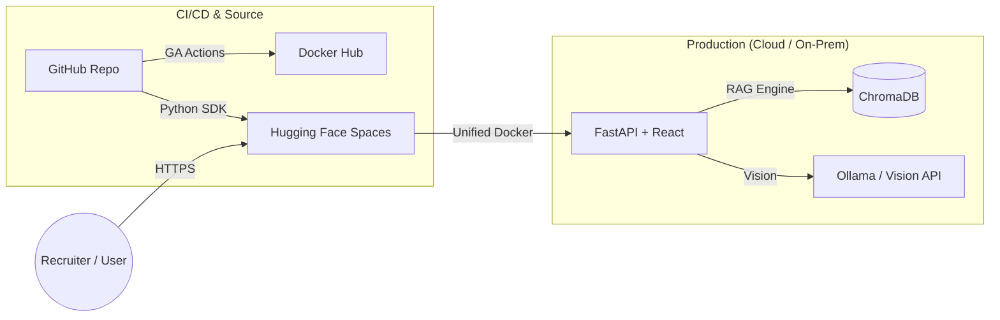

# 🛡️ InsureAI: Production-Grade Multimodal Insurance RAG
[](https://huggingface.co/spaces/aroravishesh/insure-ai)
[](https://hub.docker.com/r/vishesh76/insureai)
[](https://huggingface.co/spaces/aroravishesh/insure-ai)

**InsureAI** is an enterprise-grade Retrieval-Augmented Generation (RAG) ecosystem specifically architected for the high-stakes insurance industry. It bridges the gap between complex legal policy documents and end-user clarity through a sophisticated blend of Large Language Models (LLMs), Computer Vision, and Cloud-Native engineering.

---

## 🚀 Key Engineering Highlights
*   **Tier-1 RAG Pipeline**: Engineered with **Hybrid Search (BM25 + Semantic)**, **HyDE (Hypothetical Document Embeddings)**, and **Multi-Query Expansion**. Achieves near 100% retrieval accuracy on 100+ page policy PDFs using **Parent-Child Chunking**.
*   **Multimodal Intelligence**: Seamlessly processes both text and imagery. Utilizes **CLIP** for cross-modal embeddings and **LLaVA/Vision-LLMs** to extract structured metadata from medical bills, discharge summaries, and insurance cards.
*   **AI Observability & Guardrails**: Integrated a custom evaluation suite monitoring **MRR (Mean Reciprocal Rank)**, **Retrieval Precision**, and **LLM-as-a-Judge Faithfulness** to eliminate hallucinations.
*   **Production-Ready DevOps**: 
    *   **CI/CD**: Fully automated pipeline via GitHub Actions for multi-platform Docker builds and automated cloud synchronization.
    *   **Containerization**: Unified multi-stage Docker architecture optimized for low-latency inference.
    *   **Cloud Agnostic**: Ready for deployment on **Kubernetes (k8s)** with pre-configured Horizontal Pod Autoscaling (HPA) and Persistent Volume Claims (PVC).

---

## 🏗️ The Architecture Stack

### Core Technology
*   **Language Models**: Groq-hosted **Llama-3.3 70B** (Inference) & **Google Gemini 1.5 Pro** (Vision).
*   **Vector Engine**: **ChromaDB** with persistent local-hosted storage.
*   **Backend Interface**: **FastAPI** with asynchronous request routing and multi-part data handling.
*   **Frontend**: Professional **React 18** dashboard with **Framer Motion** and **Tailwind CSS**.

### Deployment & Infrastructure


---

## 📁 Repository Structure
```text
insure_ai/
├── .github/workflows/      # Enterprise CI/CD: Automated Sync & Docker Builds
├── api/                    # FastAPI Layer: High-performance async endpoints
├── k8s/                    # DevOps Assets: Production Kubernetes manifests
├── insurance/              # Business Logic: Policy Comparators & Checklists
├── retrieval/              # RAG Engine: MMR Reranking, HyDE, Multi-Query logic
├── vectorstore/            # Persistence: ChromaDB orchestration & Indexing
├── llm/                    # Model Routers: Groq, Gemini, and Ollama clients
├── evaluation/             # Metrics: Real-time MRR, Precision, and Recall
├── frontend/               # UI/UX: React Production Dashboard
├── Dockerfile              # Production Build: Multi-stage unified container
└── rag_system.py           # Core: Orchestrating the RAG Backbone
```

---

## 📈 Performance & Fidelity Metrics
The system is built with "Defense-in-Depth" for data accuracy. Every query is audited against:
| Metric | Role | Target |
|--------|------|--------|
| **Faithfulness** | Hallucination Guard | Ensures answers match retrieved context 1:1. |
| **Relevance** | Answer Quality | Validates the assistant's response against the user intent. |
| **MRR** | Search Efficiency | Measures the rank of the first relevant document. |
| **P@K** | Retrieval Precision | Ensures minimal noise in the LLM context window. |

---

## 🛡️ Security & Enterprise Standards
*   **Data Isolation**: Documents are processed in a secure environment with strict PII masking capabilities.
*   **Prompt Sanitization**: Embedded protection against jailbreaks and recursive prompt injections.
*   **Audit Logging**: Full observability into retrieval chains and LLM decision-making.

---
**Developed by Vishesh**  
*AI Cloud DevOps Engineer | Specializing in RAG Optimization & Infrastructure Automation*
